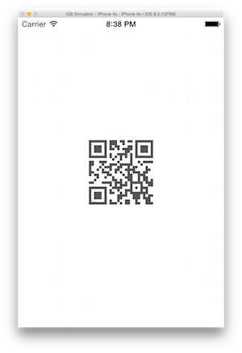

## 2D Barcode generator - wrapper of iOS QR Code Encoder

[](http://appcelerator.com/titanium/)

#### Credit: [Jnis](https://github.com/Jnis)

### Sample
 


### How to use
##### Reference module
Register your module with your application by editing `tiapp.xml` and adding your module.
Example:
````
<modules>
	<module version="0.1">com.au.qr</module>
</modules>
````

##### Use module in your code
````
/*
 * @param {String} color - supports Hex color and color name. Use black if passed color cannot be resolved
 */
var blob = mod.buildQrcode({
	"width" : 50,
	"text" : "What the hell is that!!!!",
    "color" : "#000000"
});
````

## Version
* 1.0
  * Initial version
* 1.0.1
  * Add color support

## TODO
@ Add 1D barcode generation capability

## License
MIT

